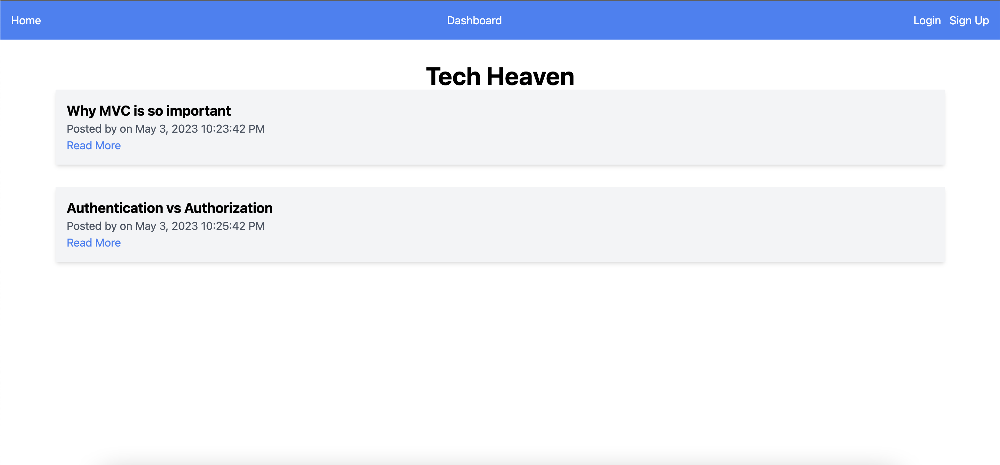

# Tech Heaven Blog App 

## Description

<strong>Introducing Tech Heaven Blog App!</strong>
 
A simple and easy-to-use blogging platform where users can create, edit, and delete their own blogs posts. Users can also view and comment on posts created by others. Built with Node.js, Express, and Sequelize, this app uses a clean, modern design to showcase user-generated content. 

    
## Table Of Contents

- [Installation](#installation)
- [Usage](#usage)
- [Contributions](#contributions)
- [Tests](#tests)
- [Questions](#questions)
- [Tool URL](#toolurl)
- [Technologies](#technologies)
- [Collaborators](#collaborators)
- [License](#license)

## Installation 

To run the blog app locally, follow these steps: 
1. Clone the repository from GitHub 
2. Run `npm install` to install all necessary dependencies
3. Create a MySQL database and update the `config/connection.js` file with your database credentials 
4. Run `npm start` to launch the application

## Usage 

Visit the homepage to view recent blog posts created by all users. Sign up for a free account to create, edit, and delete your own blog posts. Once logged in, visit the dashboard to manage your posts and click on individual posts to view and leave comments.

## Contributions 

If you would like to contribute to the Blog App, please open an issue or submit a pull request on the project's GitHub repository.

## Tests 

This project has no automated tests.

## Questions 

If you have any questions about this project, please contact the project owner by visiting their GitHub profile at [github.com/Omar4589/ZuckOnIt](https://:github.com/Omar4589/ZuckOnIt) or by emailing them at [omar4589@hotmail.com](mailto:omar4589@hotmail.com).

## Tool URL 
    
[zuckonit.herokuapp.com](https://zuckonit.herokuapp.com)
 
 
    
## Technologies 
    
The following technologies were used to develop Tech Heaven Blog App: 
 
<strong>Languages</strong>
    
- HTML,  CSS,  Javascript
    
<strong>Frameworks</strong>
    
- Tailwind
- Express
    
<strong>Libraries</strong>
    
- jQuery
- Sequelize
- bcrypt
- Day.js

<strong>Database</strong>

- MySQL

<strong>Other</strong>

- Node.js
 
    
## Collaborators 
    

    
## License 

This project is licensed under the MIT License.

MIT License Notice: A short and simple permissive license with conditions only requiring preservation of copyright and license notices. Licensed works, modifications, and larger works may be distributed under different terms and without source code.
   
